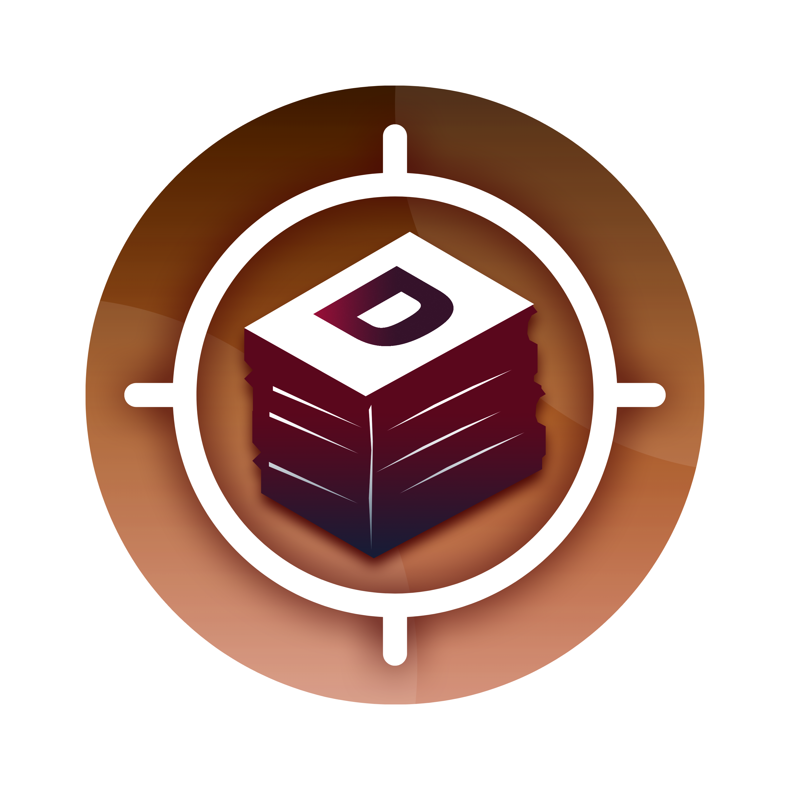

# DaGAT - Document and Governance Administration Tracker

<p align="center">
  
</p>

## Overview

DaGAT (Document and Governance Administration Tracker) is a specialized document management system developed for local school councils to streamline documentation workflows and governance processes. Built with Laravel, this comprehensive platform integrates advanced document tracking, version control, and workflow automation to ensure efficient handling of critical school council documents.

## Key Features

- **Document Management**: Create, store, track, and manage various types of documents
- **Workflow Automation**: Automated routing of documents through approval processes
- **Role-Based Access Control**: Secure access with different permission levels
- **Document Signing**: Digital signature capabilities for document approvals
- **QR Code Integration**: Generate and scan QR codes for quick document retrieval
- **Version Control**: Track document changes and maintain document history
- **Analytics Dashboard**: Real-time insights into document status and council activities
- **Activity Logging**: Comprehensive audit trails for all system actions
- **Archive System**: Long-term storage and retrieval of historical documents

## Technology Stack

- **Backend**: Laravel PHP Framework
- **Frontend**: Blade Templates, JavaScript, Bootstrap, Tailwind CSS
- **Database**: MySQL
- **Authentication**: Laravel Fortify
- **Deployment**: Compatible with Apache/Nginx servers

## Installation

### Prerequisites
- PHP 8.0+
- Composer
- MySQL
- Node.js and NPM

### Setup Steps

1. Clone the repository:
   ```
   git clone https://github.com/yourusername/DaGAT.git
   ```

2. Install PHP dependencies:
   ```
   composer install
   ```

3. Install JavaScript dependencies:
   ```
   npm install && npm run build
   ```

4. Create environment file:
   ```
   cp .env.example .env
   ```

5. Configure your database in the `.env` file:
   ```
   DB_CONNECTION=mysql
   DB_HOST=127.0.0.1
   DB_PORT=3306
   DB_DATABASE=dagat
   DB_USERNAME=root
   DB_PASSWORD=
   ```

6. Generate application key:
   ```
   php artisan key:generate
   ```

7. Run database migrations:
   ```
   php artisan migrate
   ```

8. Seed the database with initial data:
   ```
   php artisan db:seed
   ```

9. Start the development server:
   ```
   php artisan serve
   ```

## System Architecture

DaGAT follows a modular architecture with the following components:

- **User Management**: Handles user accounts, roles, and permissions
- **Document Processing**: Manages document creation, routing, and approvals
- **Notification System**: Alerts users about pending actions and document updates
- **Analytics Engine**: Provides insights into document flows and bottlenecks
- **Archive System**: Manages long-term document storage and retrieval

## Security Features

- Role-based access control
- Encrypted document storage
- Comprehensive audit logging
- Session management
- CSRF protection

## Use Cases

- **Administrative Document Management**: Streamline approval of policies, memos, and reports
- **Meeting Management**: Track minutes, agendas, and action items
- **Budget Oversight**: Manage financial documents and approval workflows
- **Policy Development**: Collaborate on and approve school policies

## Future Enhancements

- Mobile application for on-the-go access
- Advanced document OCR for searchable content
- Integration with electronic signature providers
- Enhanced analytics and reporting capabilities

## About the Developer

This project was developed as part of Deane's internship with the College of Information and Computing showcasing skills in full-stack web development, database design, and system architecture. Key technical accomplishments include implementing complex document workflows, role-based permission systems, and integrating QR code functionality.

## License

This project is licensed under the MIT License - see the LICENSE file for details.
